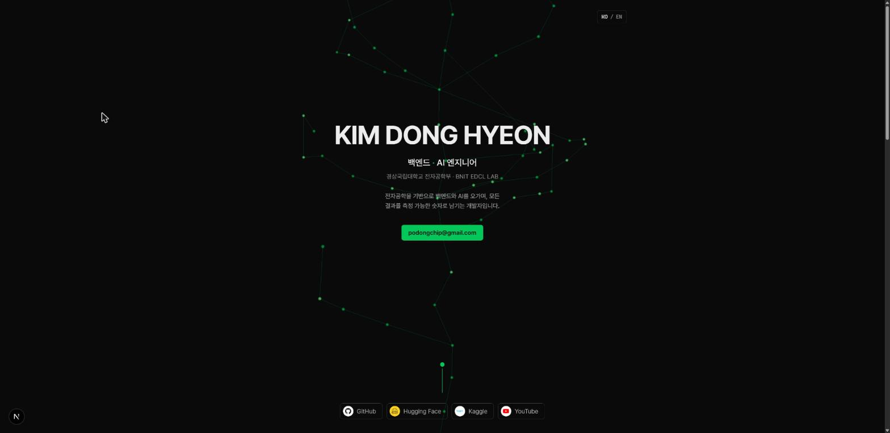

# Donghyeon Portfolio

개인 포트폴리오 웹사이트입니다. 검은 배경 위에 git 그래프 형태의 타임라인을 세우고,
글 대신 숫자와 차트로 정보를 전달합니다. 한국어/영어를 지원합니다.

🔗 **Live:** [podongchip.vercel.app](https://podongchip.vercel.app)



## 구조

단일 페이지입니다: 풀스크린 히어로(3D git 그래프 배경) → KPI 타일 4개 → git 그래프
타임라인. 상세 내용은 페이지 이동 없이 **모달**로 봅니다 — 브랜치 카드를 클릭하면
해당 항목의 상세가, KPI 타일을 클릭하면 그 카테고리의 전체 목록이 뜹니다.

루트(`/`)는 `next.config.ts`의 리다이렉트로 `/ko`에 연결됩니다.

## 디자인

- **팔레트** — 검은 배경(`#0a0a0a`) + 네이버 그린(`#03c75a`) 단일 메인 컬러. 서체는 Pretendard 하나만 씁니다.
- **git 그래프 타임라인** — 페이지 중앙의 main 줄기를 따라 위(과거)에서 아래(현재)로 내려갑니다.
  연구·개발·수상은 브랜치 카드로 갈라져 나오고, 공개한 데이터셋·모델은 **올린 날짜 위치에
  릴리즈 노드(마름모)**로 얹히며, 맨 아래는 `HEAD → 현재`로 끝납니다.
- **카테고리 색** — KPI 카드와 그래프 노드·칩·테두리(2px)가 같은 색을 공유합니다:
  프로젝트=그린(`#03c75a`) · 릴리즈=블루(`#3987e5`) · 수상=골드(`#b8860b`) · 자격증=핑크(`#e87ba4`).
  색각이상·일반시각 분리와 배경 대비를 검증 스크립트로 확인했고(골드↔그린만 허용 밴드),
  모든 카테고리에 텍스트 라벨이 함께 붙어 색 단독으로 의미를 싣지 않습니다.
- **차트** — 전부 서버 렌더링 CSS/HTML입니다 (차트 라이브러리 없음).
  - KPI 타일: 누적 다운로드(Hugging Face·Kaggle 라이브, ISR 1시간) · 자격증 · 프로젝트 · 수상
  - 전후 비교 덤벨: OCR 재현율 68→88% 등 % 지표를 0–100 축 하나에 표시 (단위가 다른 VRAM은 분리)
  - 릴리즈 노드 미니바: 공개물별 다운로드 수 (HF는 `createdAt`, Kaggle은 `lastUpdated` 기준 배치)
  - 다운로드 모달: 총합 + 플랫폼 분할 바, 공개물별 비례 바
- **히어로 3D** — 로드 시 3D git 그래프가 아래에서 위로 약 3초간 조용히 "그려진" 뒤
  정지합니다(react-three-fiber). 이후에는 마우스를 따라 살짝 기울기만 하고,
  `prefers-reduced-motion`이면 렌더링하지 않습니다.
- **모션** — 스크롤하면 카드가 아래에서 떠오르는 리빌(IntersectionObserver + CSS 트랜지션),
  카드·버튼 hover 리프트, 모달 등장 애니메이션. `prefers-reduced-motion`이면 전부 꺼지고,
  JS가 없으면 noscript 폴백이 콘텐츠를 전부 보여줍니다.

## 기술 스택

| 분류 | 사용 기술 |
| --- | --- |
| 프레임워크 | [Next.js 16](https://nextjs.org/) (App Router, Turbopack) |
| 언어 | TypeScript, React 19 |
| 스타일링 | Tailwind CSS 4 |
| 3D | Three.js, React Three Fiber (히어로 배경) |
| 배포 | Vercel |

## 시작하기

```bash
npm install
npm run dev      # http://localhost:3000 → /ko 로 리다이렉트
npm run build
npm run start
```

> Node.js 20 이상 권장

Kaggle 통계를 함께 보려면 `.env.local`에 API 키가 필요합니다. 없으면 Hugging Face 항목만 표시됩니다.

```bash
KAGGLE_USERNAME=...
KAGGLE_KEY=...
```

## 프로젝트 구조

```
app/
  [lang]/            # ko | en 라우팅 (layout이 <html>을 담당)
    page.tsx         # 메인 한 페이지 (라우트는 이것뿐)
components/
  charts/            # Dumbbell (전후 비교 덤벨)
  sections/          # Kpis (타일 + 카테고리 모달), GitGraph (그래프 + 카드 모달)
  ui/                # Hero, HeroScene·HeroSceneCanvas(3D), ModalCard, Reveal, BrandIcon, Footer, em
data/
  work.ts            # 작업 목록 (+ metrics — 카드 차트 데이터)
  timeline.ts        # 경력·수상 타임라인 (git 그래프의 데이터원)
  certifications.ts  # 자격증 목록 (KPI 타일·모달)
lib/
  i18n.ts            # 언어 타입과 헬퍼
  content/ui.ts      # 화면 문구 사전 (ko/en)
  stats.ts           # Hugging Face / Kaggle 다운로드 통계
```

## 콘텐츠 수정

모든 텍스트는 `{ ko: "...", en: "..." }` 형태로 두 언어를 함께 들고 있습니다.

- **타임라인(= 메인 그래프)** — `data/timeline.ts`. `start`(YYYY.MM) 기준 오름차순으로 그려지며,
  `kind`는 `work | project | award`. `workSlug`를 넣으면 `data/work.ts`의 요약·기술·링크가 카드에 합쳐지고,
  `highlights`를 채우면 카드·모달에 불릿 목록이 붙습니다.
- **강조** — 설명 문자열 안에서 `**이렇게**` 감싸면 굵게 렌더링됩니다.
- **수치 표** — `data/work.ts`의 `study.metrics`에 `before`를 넣으면 "이전 → 이후"로,
  %끼리인 항목은 골든링크 카드의 덤벨 차트에 자동 반영됩니다.
- **자격증** — `data/certifications.ts`에 추가하면 KPI 타일 개수·모달 목록에 반영됩니다.
- **화면 문구** — `lib/content/ui.ts`.

## 배포

[Vercel](https://vercel.com)에 배포되어 있습니다. `main` 브랜치 기준으로 프로덕션이 갱신됩니다.
